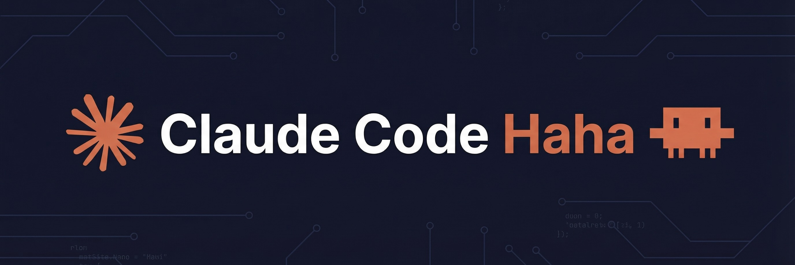
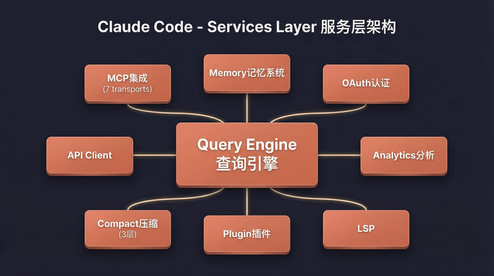

# Claude Code Haha (Refactored Fork)

<p align="center">
  
</p>

<div align="center">

[](https://github.com/NanmiCoder/cc-haha/stargazers)
[](https://github.com/NanmiCoder/cc-haha/network/members)
[](https://github.com/NanmiCoder/cc-haha/issues)
[](https://github.com/NanmiCoder/cc-haha/pulls)
[](https://github.com/NanmiCoder/cc-haha/blob/main/LICENSE)
[](README.md)
[](README.en.md)
[](https://claudecode-haha.relakkesyang.org)

</div>

基于 Claude Code 泄露源码修复的**本地可运行版本**，支持接入任意 Anthropic 兼容 API（如 MiniMax、OpenRouter 等）。

> 原始泄露源码无法直接运行。本仓库修复了启动链路中的多个阻塞问题，使完整的 Ink TUI 交互界面可以在本地工作。

---

## 关于本分支

本项目是基于 [cc-haha](https://github.com/NanmiCoder/cc-haha) 的重构分支，主要对 **Harness Engineering 模块**进行了架构解耦，将原本紧耦合的代码拆分为 Python（编排层）、Rust（执行层）和 TypeScript（集成层）的三层架构。

详细修改内容请参阅：[REFACTORING_README.md](./REFACTORING_README.md)

<p align="center">
  <a href="#功能">功能</a> · <a href="#架构概览">架构概览</a> · <a href="#快速开始">快速开始</a> · <a href="docs/guide/env-vars.md">环境变量</a> · <a href="docs/guide/faq.md">FAQ</a> · <a href="docs/guide/global-usage.md">全局使用</a> · <a href="#更多文档">更多文档</a>
</p>

---

## 功能

- 完整的 Ink TUI 交互界面（与官方 Claude Code 一致）
- `--print` 无头模式（脚本/CI 场景）
- 支持 MCP 服务器、插件、Skills
- 支持自定义 API 端点和模型（[第三方模型使用指南](docs/guide/third-party-models.md)）
- **记忆系统**（跨会话持久化记忆）— [使用指南](docs/memory/01-usage-guide.md)
- **多 Agent 系统**（多代理编排、并行任务、Teams 协作）— [使用指南](docs/agent/01-usage-guide.md) | [实现原理](docs/agent/02-implementation.md)
- **Skills 系统**（可扩展能力插件、自定义工作流）— [使用指南](docs/skills/01-usage-guide.md) | [实现原理](docs/skills/02-implementation.md)
- **Channel 系统**（通过 Telegram/飞书/Discord 等 IM 远程控制 Agent）— [架构解析](docs/channel/01-channel-system.md)
- **Computer Use 桌面控制** — [功能指南](docs/features/computer-use.md) | [架构解析](docs/features/computer-use-architecture.md)
- 降级 Recovery CLI 模式（`CLAUDE_CODE_FORCE_RECOVERY_CLI=1 ./bin/claude-haha`）

---

## 架构概览

<table>
  <tr>
    <td align="center" width="25%"><br><b>整体架构</b></td>
    <td align="center" width="25%"><br><b>请求生命周期</b></td>
    <td align="center" width="25%"><br><b>工具系统</b></td>
    <td align="center" width="25%"><br><b>多 Agent 架构</b></td>
  </tr>
  <tr>
    <td align="center" width="25%"><br><b>终端 UI</b></td>
    <td align="center" width="25%"><br><b>权限与安全</b></td>
    <td align="center" width="25%"><br><b>服务层</b></td>
    <td align="center" width="25%"><br><b>状态与数据流</b></td>
  </tr>
</table>

---

## 快速开始

### 1. 安装 Bun

```bash
# macOS / Linux
curl -fsSL https://bun.sh/install | bash

# macOS (Homebrew)
brew install bun

# Windows (PowerShell)
powershell -c "irm bun.sh/install.ps1 | iex"
```

> 精简版 Linux 如提示 `unzip is required`，先运行 `apt update && apt install -y unzip`

### 2. 安装依赖并配置

```bash
bun install
cp .env.example .env
# 编辑 .env 填入你的 API Key，详见 docs/guide/env-vars.md
```

### 3. 启动

#### macOS / Linux

```bash
./bin/claude-haha                          # 交互 TUI 模式
./bin/claude-haha -p "your prompt here"    # 无头模式
./bin/claude-haha --help                   # 查看所有选项
```

#### Windows

> **前置要求**：必须安装 [Git for Windows](https://git-scm.com/download/win)

```powershell
# PowerShell / cmd 直接调用 Bun
bun --env-file=.env ./src/entrypoints/cli.tsx

# 或在 Git Bash 中运行
./bin/claude-haha
```

### 4. 全局使用（可选）

将 `bin/` 加入 PATH 后可在任意目录启动，详见 [全局使用指南](docs/guide/global-usage.md)：

```bash
export PATH="$HOME/path/to/claude-code-haha/bin:$PATH"
```

---

## 技术棼

| 类别 | 技术 |
|------|------|
| 运行时 | [Bun](https://bun.sh) |
| 语言 | TypeScript |
| 终端 UI | React + [Ink](https://github.com/vadimdemedes/ink) |
| CLI 解析 | Commander.js |
| API | Anthropic SDK |
| 协议 | MCP, LSP |

---

## Harness Engineering 模块

本项目包含一组经过重构的模块，实现了**任务编排、记忆系统和报告生成**的解耦架构。

### 目录结构

```
src-python/                    # Python 编排层
├── coordinator/               # 任务 DAG 和编排器
│   ├── dag.py               # TaskDAG - 有向无环图调度
│   ├── orchestrator.py      # Orchestrator - 高级工作流编排
│   └── visualize.py         # DAGVisualizer - 可视化导出
├── memory/                   # 记忆系统
│   └── knowledge_graph.py   # KnowledgeGraph - 持久化知识图谱
└── exploration/              # 报告生成
    └── report_builder.py     # ReportBuilder - 结构化报告

src-rust/                     # Rust 执行层
├── tool-executor/           # 进程执行（内存/超时限制）
├── sandbox/                 # seccomp 系统调用过滤
├── vcr/                     # API 响应录制/回放
└── verification/           # 对抗性验证框架

src/integration/              # TypeScript 集成层
├── taskDagWrapper.ts       # TaskDAG TypeScript 包装器
├── knowledgeGraphWrapper.ts # KnowledgeGraph TypeScript 包装器
├── reportBuilderWrapper.ts  # ReportBuilder TypeScript 包装器
└── adapters.ts              # 现有代码库适配器
```

### 核心模块

#### TaskDAG - 任务调度

有向无环图实现，支持拓扑排序和并行执行：

```python
from coordinator import TaskDAG

dag = TaskDAG()
dag.add_task('a', 'Task A')
dag.add_task('b', 'Task B', deps=['a'])
dag.add_task('c', 'Task C', deps=['a'])
dag.add_task('d', 'Task D', deps=['b', 'c'])

# 获取执行顺序（Kahn 算法）
levels = dag.get_execution_order()
# [['a'], ['b', 'c'], ['d']]

# 可视化（Mermaid 格式）
print(dag.visualize())
```

#### KnowledgeGraph - 记忆系统

持久化知识图谱，支持加权搜索和关系追踪：

```python
from memory import KnowledgeGraph, MemoryType

kg = KnowledgeGraph()
kg.add('user_role', 'Senior engineer', MemoryType.USER,
       importance=0.9, tags=['role', 'engineering'])
kg.add('feedback_testing', 'Use real DB', MemoryType.FEEDBACK,
       importance=0.85, tags=['testing'])

# 加权搜索（name 3x > description 2x > content 1x）
results = kg.search('engineer', memory_types=[MemoryType.USER])

# 关系追踪
kg.add_relationship(e1.id, e2.id)
related = kg.get_related(e1.id)
```

#### ReportBuilder - 报告生成

结构化报告生成，支持 Mermaid 图表：

```python
from exploration import ReportBuilder

rb = ReportBuilder('Verification Report', scope='e2e-test')
rb.add_chapter('Executive Summary')
rb.add_section('Results', 'All tests passed.')
rb.add_finding('Critical Bug', 'Found issue', severity='critical')

# 架构图
rb.add_architecture_diagram('System',
    [{'id': 'api', 'label': 'API', 'type': 'service'}],
    [('api', 'db', 'queries')]
)

rb.set_completed()
print(rb.build_markdown())
```

#### Orchestrator - 编排器

整合 DAG、Memory 和 Report 的高级编排器：

```python
from coordinator import create_orchestrator

orch = create_orchestrator("My Workflow", max_parallel=4)
orch.add_tasks_batch([
    {'id': 'step1', 'name': 'Initialize'},
    {'id': 'step2', 'name': 'Process', 'deps': ['step1']},
])

async def executor(task_id):
    return f"done-{task_id}"

result = await orch.execute(executor)
report = orch.generate_report()
```

### 工作流示例

```
用户请求
    │
    ▼
Orchestrator.execute()
    │
    ├─► TaskDAG.getExecutionOrder()  # 拓扑排序
    │       │
    │       ▼
    │   [Level 1] ─► [Level 2] ─► ...  # 并行执行
    │       │
    │       ▼
    │   executor(task) ─► memory.add() ─► report.add_finding()
    │
    ▼
generate_report() ─► Markdown / JSON
    │
    ▼
memory.save()  # 持久化
```

### 测试

```bash
# Python 模块测试
PYTHONPATH=/tmp/cc-haha/src-python python3 -c "
from coordinator import TaskDAG
from memory import KnowledgeGraph
from exploration import ReportBuilder
print('All modules imported successfully')
"

# 端到端测试
cd /tmp/cc-haha/src-python && python3 << 'EOF'
import asyncio
from coordinator import TaskDAG

async def executor(tid):
    await asyncio.sleep(0.01)
    return f"done-{tid}"

dag = TaskDAG()
dag.add_task('a', 'Task A')
dag.add_task('b', 'Task B', deps=['a'])
results = asyncio.run(dag.execute(executor))
print(f"Executed {len(results)} tasks")
EOF
```

---

## 更多文档

| 文档 | 说明 |
|------|------|
| [环境变量](docs/guide/env-vars.md) | 完整环境变量参考和配置方式 |
| [第三方模型](docs/guide/third-party-models.md) | 接入 OpenAI / DeepSeek / Ollama 等非 Anthropic 模型 |
| [记忆系统](docs/memory/01-usage-guide.md) | 跨会话持久化记忆的使用与实现 |
| [多 Agent 系统](docs/agent/01-usage-guide.md) | 多代理编排、并行任务执行与 Teams 协作 |
| [Skills 系统](docs/skills/01-usage-guide.md) | 可扩展能力插件、自定义工作流与条件激活 |
| [Channel 系统](docs/channel/01-channel-system.md) | 通过 Telegram/飞书/Discord 等 IM 平台远程控制 Agent |
| [Computer Use](docs/features/computer-use.md) | 桌面控制功能（截屏、鼠标、键盘）— [架构解析](docs/features/computer-use-architecture.md) |
| [全局使用](docs/guide/global-usage.md) | 在任意目录启动 claude-haha |
| [常见问题](docs/guide/faq.md) | 常见错误排查 |
| [源码修复记录](docs/reference/fixes.md) | 相对于原始泄露源码的修复内容 |
| [项目结构](docs/reference/project-structure.md) | 代码目录结构说明 |

---

## Disclaimer

本仓库基于 2026-03-31 从 Anthropic npm registry 泄露的 Claude Code 源码。所有原始源码版权归 [Anthropic](https://www.anthropic.com) 所有。仅供学习和研究用途。
